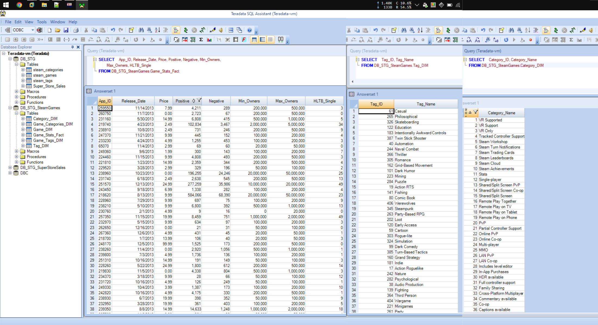
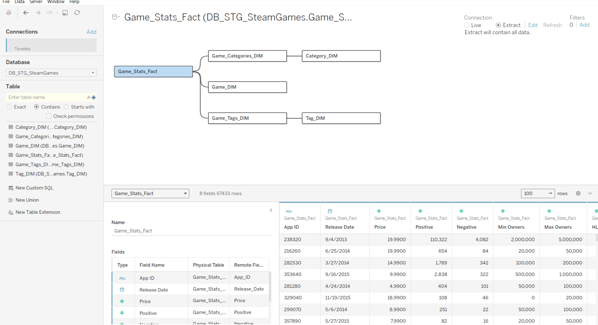
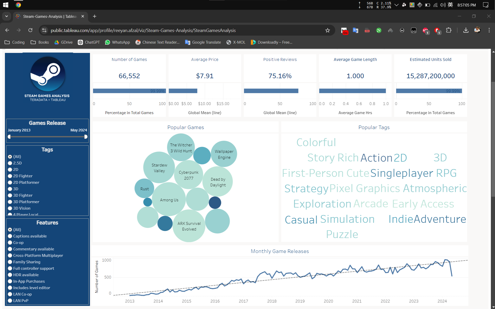

###  DWH & Power BI - Course Final Assignment 

#### Author - Reeyan Afzal
#### Original Author - Terenci Claramunt

To Check The Dashboard: **[Steam-Games-Analysis](https://public.tableau.com/app/profile/reeyan.afzal/viz/Steam-Games-Analysis/SteamGamesAnalysis)** 

After attending the course for 3 months now, while mostly took classes once per week (only on Sunday). I still learned a lot about Data warehousing. We mostly used **Teradata**. The assignment that was given to me was to explore the [Steam Games Analysis](https://www.kaggle.com/code/terencicp/steam-games-data-transformation/notebook) even though it is not perfect. I still had a lot of fun while finishing this assignment.
___

